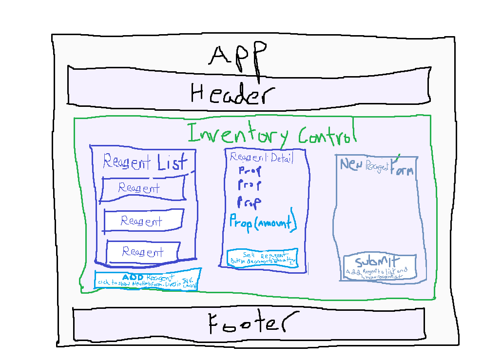

# Mathilda's Apothecary

#### A single page site used my Mathilda to track her inventory of alchemy reagents. She can use this site to add Reagents to the inventory, all reagents are purchased at a set quantity of 25. She can examine and edit the details of each reagent and sell them one by one using a handy button. Once the quantity is set to zero she can no longer sell and she will be informed that the product is SOLD OUT. 

## Authored by:
Hans Ellis March 2023

***

## Table of Contents
1. [Technologies Used](#technologies-used)
2. [Setup Instructions](#installation-and-setup)
3. [Known Bugs](#known-bugs)
4. [License Information](#license)
5. [Component Diagram](#component-diagram)

## Technologies Used

- React

## Installation And Setup

1. Clone the repository: '[https://github.com/mrhansellis/mathildas-apothecary]'
2. Navigate to the '[apothecary]' directory on your computer
3. Open with your favorite text editor
4. To start a development server and view the project in the browser:
    - Navigate to '[bird-track]' in your command line
    - Run the command "npm install" to install dependencies
    - Optionally, run the command "npm run build" to bundle the files
    - Finally, run the command "npm run start" to start a development server

## Known Bugs
- When a single reagent is updated (by form or by "sell" button) that reagent will appear at the bottom of the reagent list, this is likely a result of using the concat() method to update the list.
- Cannot update quantity and stay on details page.
- Styling missing from forms.
- Wonky animated icon.

## Component Diagram

## License
*Hans Ellis, January 2023. Available for distribution, modification, inspection, and application under [GPLv3 License](https://www.gnu.org/licenses/gpl-3.0.en.html)*

This application makes previous work from the Epicodus staff as a reference for learning material. It has been used with permission of the staff.
